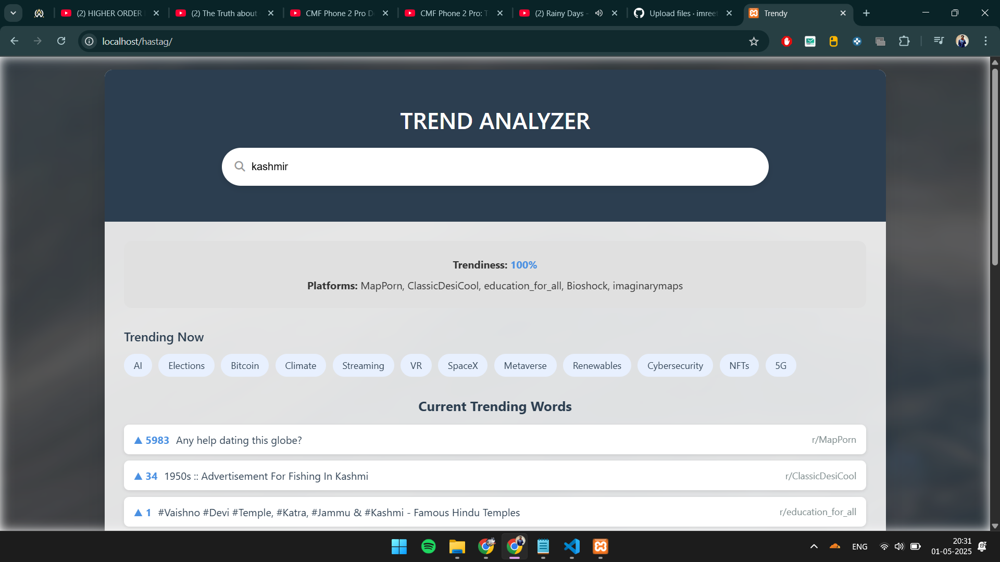
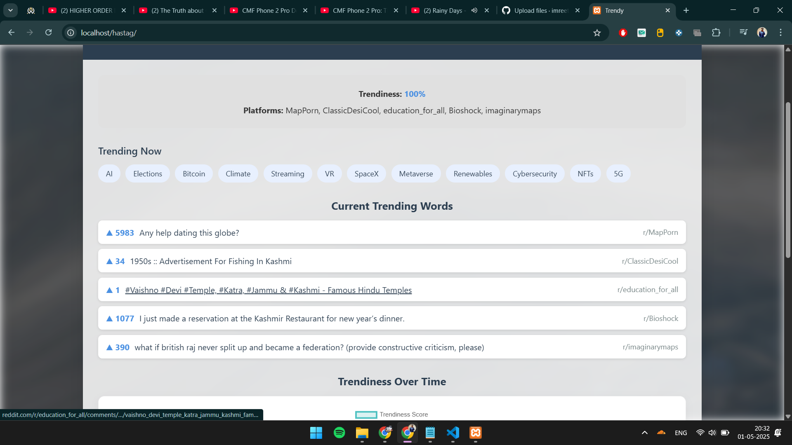
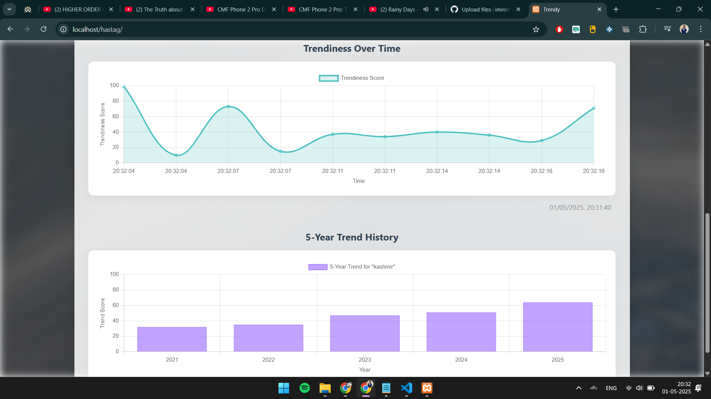

# 🧠 Trendy

**Trendy** is a responsive web application that visualizes the trendiness of search terms using live Reddit data. The project provides real-time trend scores, a five-year historical chart, and a dynamic list of trending words — all wrapped in a clean, modern UI.

## 🔍 Features

- 🔎 Search for any keyword or topic and see its trendiness.
- 📊 Real-time line chart showing live trend score updates.
- 📈 Historical 5-year bar chart of trend scores.
- 🌐 Fetches trending data from Reddit (via Reddit public API).
- 🎨 Modern responsive design using HTML, CSS, and JavaScript.
- 📅 Timestamped updates with Reddit post analysis.

## 🧪 Technologies Used

- HTML5
- CSS3 (with custom properties & flexbox)
- JavaScript (Vanilla)
- [Chart.js](https://www.chartjs.org/) for data visualization
- Reddit public API for fetching real-time trends

## 📁 File Structure

```
index.html        # Main HTML page
style.css         # Custom styles and responsive layout
script.js         # Logic for charts, API fetching, and DOM updates
```

## 🚀 How to Run

1. Clone the repository:
   ```bash
   git clone https://github.com/yourusername/trend-analyzer.git
   cd trend-analyzer
   ```

2. Open `index.html` in your preferred browser.

> **Note**: No backend is required. Everything runs client-side using Reddit’s public API and Chart.js.

## 📸 Screenshots

| Search | Real-Time Chart  | RealTime Trends |
|--------|------------------|-----------------|
|  |  |  |

## ⚠️ Limitations

- Limited to Reddit’s search API for data fetching.
- API call limits may apply.
- Currently uses simulated data for real-time and historical trends.

## 🛠️ Future Improvements

- Add sentiment analysis of posts.
- Integrate Twitter/X and Google Trends APIs.
- Enable user authentication to save trend searches.
- Mobile-native support with PWA capabilities.

## 📄 License

This project is open-source and available under the [MIT License](LICENSE).

## 🌐 Live Demo
Check out the live version of the website here: [View Website](https://imreet.github.io/Trendy/)
